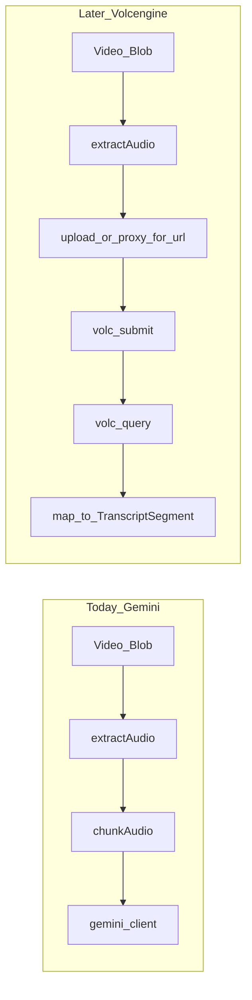

# Volcengine Doubao ASR (post-hosting) — integration plan

## Goal

Add an optional **transcription provider**: keep **Gemini** as default, and allow **Volcengine 豆包语音 — 大模型录音文件识别（标准版）** when the user selects it. Document: [大模型录音文件识别标准版 API](https://www.volcengine.com/docs/6561/1354868?lang=zh).

**Whisper work is tracked separately:** [whisper_transcription.plan.md](whisper_transcription.plan.md).

## Why hosting (or upload) matters first

The Volcengine submit API expects **`audio.url`** — a URL their servers can **HTTP fetch**. A user’s local **Blob** in the browser is not sufficient by itself.

- **Option A:** Upload audio to your storage → public or signed URL → `submit`
- **Option B:** Backend proxy: browser → your API → Volcengine (hides key, fixes CORS)

## Non-breaking shape

- **Default:** `transcribeProvider = 'gemini'`; existing Gemini key + model.
- **Optional Volcengine:** `X-Api-Key`, `X-Api-Resource-Id` (e.g. `volc.seedasr.auc`), etc.

## Implementation sketch

1. **Types** — extend provider enum with `volcengine`; Volc credentials in settings.
2. **New** `src/core/volc-asr-client.ts` — submit + poll; map `result.utterances` (ms → seconds); `enable_speaker_info` optional.
3. **Transcription** — Volc branch after `extractAudio`: obtain URL → submit → poll → normalize.
4. **Settings UI** — Volc fields when selected.
5. **Hardening** — CORS test to `openspeech.bytedance.com`; error code mapping.

## Acceptance

- Default Gemini unchanged.
- Volc + valid URL + credentials → same `TranscriptSegment` UX.

## Out of scope here

- OpenAI Whisper — see [whisper_transcription.plan.md](whisper_transcription.plan.md).
